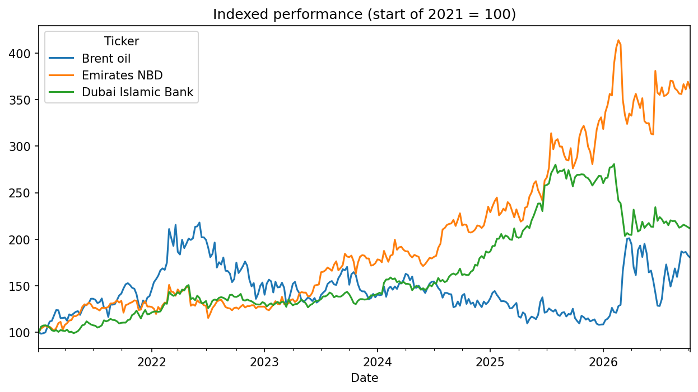
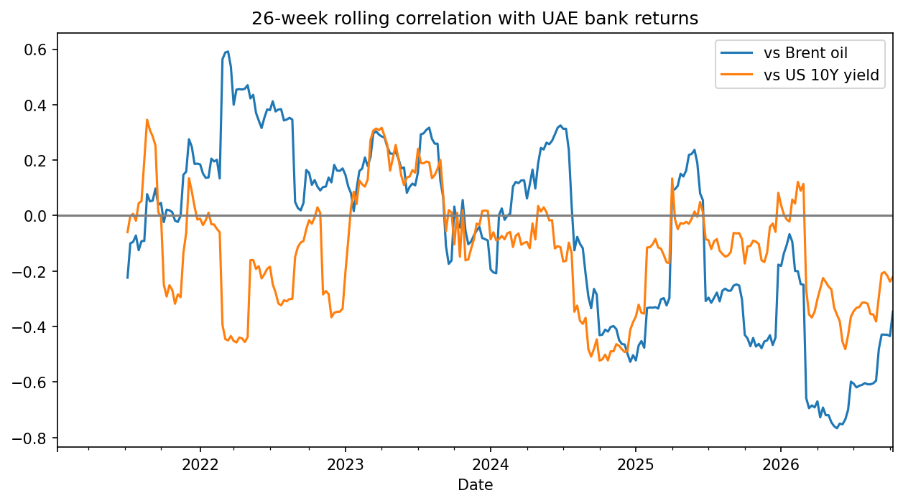

# What Drives UAE Bank Stocks: Oil or US Rates?

## Question
Do weekly returns of UAE banks follow Brent crude or US interest rates?
The dirham is pegged to the US dollar, so US rates could matter for bank
margins, while oil drives much of the region's government revenue.

## Data
Yahoo Finance via the yfinance library, January 2021 to October 2026,
converted to weekly (Friday close) returns, 300 observations.
- Brent crude futures (BZ=F)
- US 10-year Treasury yield (^TNX), weekly change in yield
- Emirates NBD (EMIRATESNBD.AE) and Dubai Islamic Bank (DIB.AE)

## Method
Weekly percentage returns (weekly change for the yield), correlation
matrix (Pearson and rank-based Spearman), 26-week rolling correlation,
and a split into 2021-22 and 2023-now.

## Findings
- Over the full period, weekly UAE bank returns showed negligible
  correlation with Brent (-0.15 Pearson, -0.09 rank-based) and changes in
  the US 10-year yield (-0.14, -0.11). Rank-based figures are within the
  range expected from noise for 300 observations.
- Sub-period results were sensitive to the method. The apparent positive
  oil link in 2021-22 (+0.23) disappeared on a rank basis (+0.05). Since
  2023 the oil link was weakly negative (-0.33 Pearson, -0.16 rank-based).
- The yield link in 2021-22 (-0.19, -0.20) was consistent across methods
  but only just outside the noise range.
- The 26-week rolling correlation with oil swung between about +0.6 and
  -0.75 (and between +0.35 and -0.5 for yields), so the relationship is
  unstable. Windows of 26 weeks are noisy (noise band of roughly ±0.4);
  the most extreme stretches (early 2022, 2026) are short episodes that
  were not investigated further.
- Conclusion: neither oil nor US rates is a consistent short-term driver
  of these two banks at weekly frequency. Differences between periods
  should be treated as tentative.

## Charts

## Limitations
- Two banks, about six years, weekly data only.
- Correlation is not causation, and I did not test why relationships
  changed between periods.
- Mashreq was tested and removed: 27% of its weekly returns were zero
  (thin trading or stale data).
- Many correlations were examined, so isolated results near the noise
  threshold may be chance. Results are sensitive to a few extreme weeks
  (Pearson and Spearman differ).
- Brent futures prices roll between contracts, and Yahoo data on regional
  stocks can contain gaps.
- Oil and US yields are themselves correlated (0.23), which makes the two
  effects hard to separate.

## Files
Notebook, indexed.png, rolling_corr.png, correlations.csv
